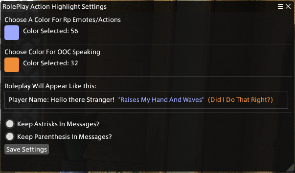

# RPChatHighlights
This is a plugin made with the  for the 

The plugin is made to allow the user to have text surrounded by Astrisks and Parenthesis Colored in a different way other than the main text.

## Main Points

* Small-ish Plugin

  * /RPH - To Toggle the plugin ON/OFF
  * /rphighlight - To Open The Config Window
* Choose Whether To Keep In Astrisks and Parenthasis Separately
* Choose any Color From List Of FFXIV Compatible Colors!
 
I haven't really done too much coding so I'm not sure of the full impact/stability of the plugin but I've tried my best!

### Activating in-game
## Repo Link
> https://raw.githubusercontent.com/ABagOSunshine/RPChatHighlight/refs/heads/main/RPHighlight/RPHighlight.json

1. Launch the game and use `/xlsettings` in chat or `ESC` and select `Dalamud Settings` to open the settings.
    * In here, go to `Experimental`, and add the full Repo Link to the list of Plugin Locations.
2. Next, use `/xlplugins` (chat) or `xlplugins` (ESC) to open up the Plugin Installer.
    * In here, go to `All Plugins Tab (left)`, and search `RPHighlight`. Enable it.
3. You should now be able to use `/rph` and `/rphighlight` commands!

### Building From Code
1. Open up `SamplePlugin.sln` in your C# editor of choice (likely [Visual Studio 2022](https://visualstudio.microsoft.com) or [JetBrains Rider](https://www.jetbrains.com/rider/)).
2. Build the solution. By default, this will build a `Debug` build, but you can switch to `Release` in your IDE.
3. The resulting plugin can be found at `SamplePlugin/bin/x64/Debug/SamplePlugin.dll` (or `Release` if appropriate.)

This plugin is built off of  by the AWESOME Goatcorp
